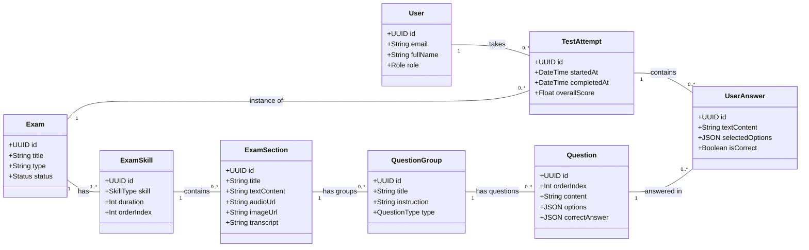

# Database Schema Design (ERD)

Here is the visual representation of the proposed database schema for the IELTS Mock Test System.

## Key Design Decisions

1.  **QuestionContainer**: Handles shared resources. For a Reading test, this holds the "Passage". For Listening, it holds the "Audio" for a specific part. Questions are child nodes of this container.
2.  **JSON for Complexity**: `options` and `correctAnswer` in the `Question` table use `JSON`. This allows storing simple strings for Fill-in-the-blanks or structured objects for Multiple Choice without creating 5-6 extra tables.
3.  **Flexible Scoring**: `UserAnswer` stores the raw input and the system (or admin) calculates `scoreEarned`.
4.  **Skill Separation**: `ExamSection` explicitly separates Listening/Reading/Writing/Speaking, allowing detailed analytics per skill.
