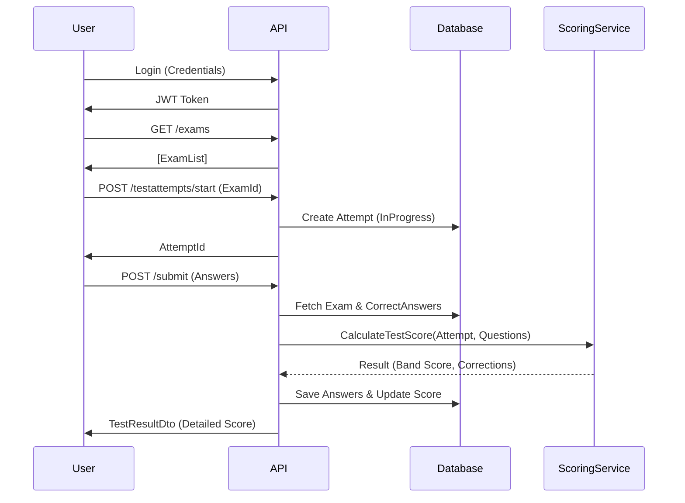

# Study4Clone System Documentation & Flow Guide

## 1. System Overview
This document serves as a technical onboarding guide and architectural reference for the Study4Clone Backend (S4C_BE). The system is built using **.NET 10** following **Clean Architecture** principles, ensuring separation of concerns and testability.

### Architecture Layers
- **Api**: Handling HTTP requests, Controllers, and Entry point.
- **Application**: Business logic, Interfaces (`IScoringService`), DTOs, and Validators.
- **Domain**: Core Entities (`Exam`, `Question`, `TestAttempt`), Enums, and Constants.
- **Infrastructure**: Database context (`AppDbContext`), Repositories, External Services implementation.

---

## 2. Key User Workflows (API Flow)

### 2.1. Authentication Flow
**Goal:** User obtains a secure token to access protected resources.

1.  **Registration**:
    -   **API**: `POST /api/auth/register`
    -   **Input**: `username`, `email`, `password`
    -   **Logic**: Hashes password (BCrypt), creates `User` entity.
2.  **Login**:
    -   **API**: `POST /api/auth/login`
    -   **Input**: `email`, `password`
    -   **Logic**: Verifies hash. Generates **JWT Token** containing `sub` (UserId) and `email`.
3.  **Authenticated Requests**:
    -   Client sends header: `Authorization: Bearer <token>`
    -   **Middleware**: Validates signature and expiration. Sets `User.Identity`.

### 2.2. Exam Taking Flow (Core Feature)
**Goal:** User takes an IELTS practice test and receives an instant band score.

1.  **Browse Exams**:
    -   **API**: `GET /api/exams`
    -   **Response**: List of available exams (e.g., "Cambridge IELTS 18").
2.  **Start Test**:
    -   **API**: `POST /api/testattempts/start`
    -   **Input**: `examId`
    -   **Logic**:
        -   Checks if an *active* attempt already exists.
        -   Creates a new `TestAttempt` with status `InProgress`.
        -   Returns `attemptId`.
3.  **Submit Answers**:
    -   **API**: `POST /api/testattempts/{id}/submit`
    -   **Input**: List of answers (`questionId`, `textContent` or `selectedOptions`).
    -   **Logic (Scoring Engine)**:
        -   **Retrieval**: Fetches full Exam + Questions + CorrectAnswers.
        -   **Grading**: `ScoringService` compares User Answers vs Correct Answers.
            -   *MCQ/TrueFalse*: Exact match.
            -   *FillBlank*: Case-insensitive, trimmed match.
        -   **Calculation**: Converts raw score to **IELTS Band (0-9.0)**.
        -   **Persist**: Saves `UserAnswers` and updates `TestAttempt` status to `Completed`.
    -   **Response**: Full `TestResultDto` with breakdown by Skill (Listening, Reading, etc.).
4.  **Review History**:
    -   **API**: `GET /api/testattempts/user/{userId}`
    -   **Logic**: fetches specific user's test history.

---

## 3. Component Analysis & Code Review

### 3.1. Data Seeding (`DataSeeder.cs`)
-   **Role**: Populates the database with initial functional data so the app is usable immediately.
-   **Current Behavior**: Checks if `Exams` table is empty. If so, seeds a complete "Cambridge IELTS 18" test structure (Exam -> Skills -> Sections -> Groups -> Questions).
-   **Review**: *Good implementation using `EnsureCreated` checks. Recently fixed JSONB typing issue for `CorrectAnswer`.*

### 3.2. Scoring Service (`ScoringService.cs`)
-   **Role**: The "Brain" of the assessment module.
-   **Key Feature**: Polymorphic scoring based on `QuestionType`.
    -   *Extension Point*: Currently handles auto-scored types well. Essay/Speaking just return `false` (0 points), which is safe for MVP but needs a manual grading queue in the future.
-   **Band Score**: Implements a simplified conversion table. *Future Improvement: different conversion tables for General Training vs Academic.*

### 3.3. Database Schema
-   **Entity Framework Core**: Code-First approach.
-   **Complex Types**: `Listening`, `Reading`, `Writing`, `Speaking` are modeled as `Skills` linking `Exams` to `Sections`.
-   **Optimization**: `UserAnswers` are stored relationally but linked to specific Attempts, allowing easy historical playback.

---

## 4. Operational Guide for Developers

### How to Run Locally
1.  **Prerequisites**: Docker (for Postgres) or Local Postgres, .NET 10 SDK.
2.  **Database Setup**:
    ```bash
    dotnet ef database update --project src/Study4Clone.Infrastructure --startup-project src/Study4Clone.Api
    ```
3.  **Run API**:
    ```bash
    dotnet run --project src/Study4Clone.Api
    ```
4.  **Verify**: Open `http://localhost:5041/swagger` to see the endpoints.

### How to Extend
-   **Adding a new Question Type**:
    1.  Add to `QuestionType` enum.
    2.  Update `ScoringService.ScoreAnswer` switch case.
    3.  Frontend: Add new rendering component.

---

## 5. Visual Flow (Mermaid)


